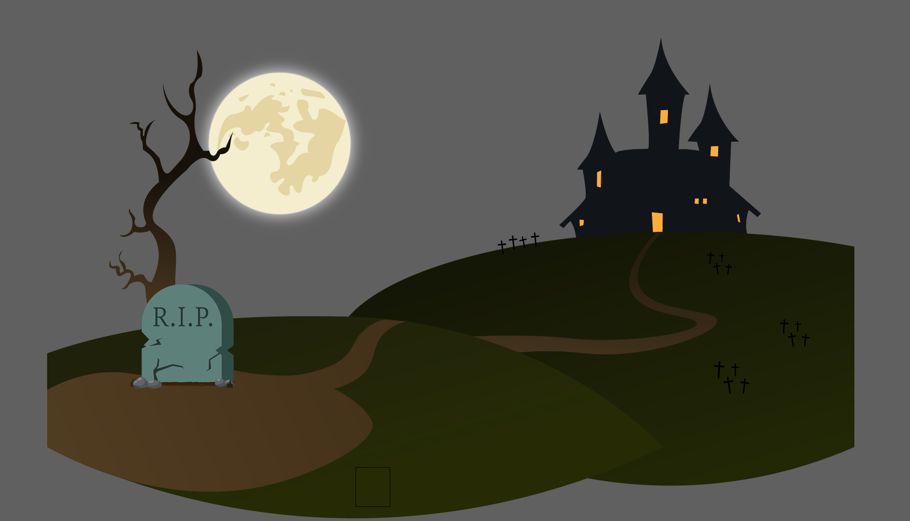

# readme voor API
Dit project maak ik in het kader van de minor Design and Development in 2025. Mijn doel is om ervaring op te doen met animatielibraries en te onderzoeken hoe ze werken en wat ik ermee kan bereiken in webontwikkeling. Daarom ga ik aan de slag met zowel Lenis als GSAP.

Om het concept overzichtelijk te houden, bouw ik een overzichtspagina met films, waarin per film beknopte informatie wordt weergegeven. Op de detailpagina voeg ik een trailer toe. De nadruk ligt in dit project op het toepassen en verfijnen van animaties.

## installatie
  

    Om dit project lokaal te installeren, volg je de onderstaande stappen:
  

  <ol>
    <li>Voer <code>npm install</code> uit om alle benodigde packages te downloaden.</li>
    <li>Start de ontwikkelserver met <code>npm run dev</code>.</li>
    <li>
      Zorg ervoor dat je een <strong>.env</strong>-bestand aanmaakt in de hoofdmap van het project.
      Voeg hierin je persoonlijke API-sleutel toe, zoals in het volgende voorbeeld:
      <pre><code>VITE_TMDB_API_KEY=your_api_key_here</code></pre>
    </li>
    <li>
      Je kunt een API-sleutel aanvragen via 
      <a href="https://www.themoviedb.org/" target="_blank" rel="noopener noreferrer">
        The Movie Database (TMDB)
      </a>.
    </li>
  </ol>

## week 1
Deze week heb ik weinig gedaan aangezien ik ziek was dus neem dit samen met week 2. 

## week 2
Na een moeilijke eerste week, waarin ik ziek was, moest ik snel een plan opstellen voor mijn project. Omdat er al een paar opties op de DLO werden aangegeven, besloot ik iets eenvoudigs te kiezen, wat me meteen vertrouwd leek. Ik koos ervoor om met de TMDB-dataset te werken en de stijl van Netflix toe te passen, een ontwerp waar ik al goed mee bekend ben.

In week 2 ben ik meteen begonnen met het opzetten van een werkveld waar ik zou kunnen coderen. Dit proces ging gelukkig vrij soepel, aangezien ik al ervaring had met Project Tech en het meeste nog goed herinnerde. Nadat alles goed was opgezet, maakte ik de basisroute voor het project en begon ik met het onderzoeken van de TMDB-dataset. De dataset bevatte veel gegevens, maar ik richtte me in eerste instantie op het ophalen van filmomslagen en de namen van films om deze weer te geven op de homepage.

Om dit te realiseren, haalde ik de links van de films op via een constante genaamd options. In deze constante plaatste ik een GET-functie met mijn API-sleutel, zodat ik niet telkens de sleutel hoefde in te voeren wanneer ik gegevens opvroeg uit de API.

### routes
Ik moest natuurlijk alles mee geven in mijn main route. De eerste stap was het opzetten van de routes. Ik begon met een eenvoudige GET-route voor de homepage. De homepage zou de lijst van films tonen, en de detailpagina zou meer gedetailleerde informatie over een geselecteerde film bevatten. Voor nu zou ik de id en de poster mee geven aan de film (later zou ik ook genres toe voegen). Dit deed ik door de link met de options functies in te laden en de juiste info er uit te halen en te renderen op de pagina.

### Werken met Liquid
Toen de basisroutes stonden, ging ik voor het eerst aan de slag met Liquid, de templating engine die ik gebruikte om de gegevens dynamisch weer te geven. De eerste stap was het begrijpen van de juiste syntaxis voor het weergeven van variabelen en loops in Liquid. Dit kostte wat tijd, maar uiteindelijk ontdekte ik dat het vrij eenvoudig te gebruiken was. In Liquid gebruikte ik de for-loop om door de films heen te itereren en de naam en afbeelding van elke film weer te geven.

### De Detailpagina
De detailpagina's waren de volgende stap, en dit was een stuk ingewikkelder. De uitdaging was om de juiste ID van een film door te geven vanuit de homepage naar de detailpagina, zodat ik de juiste gegevens voor die specifieke film kon ophalen. Eerst had ik wat moeite om dit goed op te zetten, maar ik ontdekte uiteindelijk dat ik eenvoudig de film-ID in de URL moest opnemen en deze met behulp van de req.params in de backend moest ophalen.

<code>
app.get("/movie/:id", async (req, res) => {
  const movieId = req.params.id; // Haal de film-ID op uit de URL
  // Haal de gegevens voor de film op en render de detailpagina
});
</code>

### resultaten
Aan het einde van week 2 had ik een werkende homepage met films die werden opgehaald uit de TMDB API en weergegeven op de pagina. Ook had ik de detailpagina werkend, waar de gebruiker de specifieke informatie van een film kon zien door simpelweg op de film te klikken. De basisroutes voor de homepage en detailpagina waren dus goed opgezet, maar de genre-specifieke pagina's had ik nog niet gerealiseerd. Dit was iets wat ik in week 3 zou gaan doen.

In mijn gesprek met Syd werd duidelijk dat mijn project nog te simpel was en dat er weinig nieuws te ontdekken viel. Op basis van dit feedback besloot ik om de website verder uit te breiden door genre-specifieke pagina's toe te voegen en gebruik te maken van de animatielibraries Lenis en GSAP, die door Syd werden aanbevolen.

Door Lenis te gebruiken, wilde ik de homepage verbeteren met een oneindige scrollfunctie, en voor de detailpagina’s wilde ik geanimeerde SVG’s gebruiken om de visuele ervaring te verbeteren.

## week 3
De derde week zat vol met verschillende uitdagende taken die ik voor mezelf had gesteld. Mijn doelen waren het implementeren van een infinite scroll systeem met animaties, een view animatie en een kleine hoveranimatie om genres aan te geven.

### infinite scroll
In week 3 ben ik begonnen met het maken van een infinite scroll, waarbij ik gebruik maakte van Lenis. Ik had een CodePen van Syd ontvangen die ik als basis kon gebruiken. Aan het einde van de week had ik een werkend systeem waarbij nieuwe plaatjes werden ingeladen zodra je dichtbij het einde van de pagina kwam. Het werkte goed, maar toen ik het aan Declan liet zien, kwamen we erachter dat er nog enkele bugs waren en dat het steeds trager werd naarmate je verder scrolde. Dit was niet ideaal, dus besloot ik het systeem te vereenvoudigen en het meer te laten lijken op de originele versie die Syd me had laten zien. Uiteindelijk zorgde ik ervoor dat de pagina je naar boven teleportte zodra je het einde bereikte.

De code voor de infinite scroll zag er als volgt uit:

<code>
  // ✅ Init Lenis with true infinite scroll
  const lenis = new window.Lenis({
    infinite: true,
    smooth: true,
    syncTouch: true,
    duration: 1.2,
    easing: (t) => Math.min(1, 1.001 - Math.pow(2, -10 * t))
  });
</code>

### animatie van de scroll
Met de infinite scroll in plaats, wilde ik de ervaring interessanter maken door animaties toe te voegen aan de scrollbewegingen. Ik besloot elke andere rij sneller te laten bewegen dan de andere, wat ik eenvoudig met CSS kon doen. 

Hier is de code die ik gebruikte:

<code>
    li:nth-child(odd) {
      --scroll-distance: var(--scroll-fast);
      animation-name: scrollByVar;
      animation-timeline: scroll();
      animation-duration: auto;
      animation-fill-mode: both;
   }

   li:nth-child(even) {
      --scroll-distance: var(--scroll-slow);
      animation-name: scrollByVar;
      animation-timeline: scroll();
      animation-duration: auto;
      animation-fill-mode: both;
    }

    @keyframes scrollByVar {
   from {
     transform: translateY(0);
   }
   to {
     transform: translateY(var(--scroll-distance));
   }
 }
</code>

Deze CSS zorgt ervoor dat de even genummerde items langzamer bewegen en de oneven items sneller bewegen, afhankelijk van hun --scroll-distance. Daarnaast heb ik een animatie toegevoegd voor de afbeeldingen zelf. Deze animatie zorgt ervoor dat de afbeeldingen schalen van 0.1 naar hun normale grootte zodra ze in beeld komen. De code voor deze animatie was:

<code>
      img {
         width: 100%;
         height: auto;
         border-radius: 1%;
         will-change: transform, opacity;
         transition: transform 0.3s ease, opacity 0.3s ease;
         --hue: calc(var(--sibling-index) * 5); 
         

         animation-timeline: view(block 5% 5%);

         animation-name: grow;
         animation-fill-mode: both; 
         animation-duration: 1ms;
         position: relative;

         &:hover {
            box-shadow: 0px 0px 20px oklch(70% 70% var(--hue));
          }
      }
</code>

Deze combinatie van scrollanimaties zorgt voor een dynamische en visueel interessante homepagina.

### de cards leuker maken
Hoewel de homepagina er nu beter uitzag met de animaties, vond ik dat de cards nog wat verbeterd konden worden. Ik verwijderde de filmnamen en zorgde ervoor dat alleen de afbeeldingen zichtbaar waren. Vervolgens haalde ik de genres op uit de database en stuurde deze door naar de hoofdpagina, zowel als naam als als nummer. 

Dit deed ik met behulp van de volgende code:

Ik gebruikte de genres in de HTML op twee manieren: als een class:

En als een sibling-index:

Dit stelde me in staat om genre-specifieke kleuren en iconen toe te voegen. Ik had namelijk in Illustrator iconen gemaakt die ik gebruikte in de ::before en ::after pseudo-elementen om een hoveranimatie voor de cards te creëren. De indexnummers gebruik ik om een achtergrondkleur per genre toe te voegen via de oklch kleurfunctie. 

Het eindresultaat zag er zo uit:

### view transistion
Nu ik tevreden was met de homepagina, wilde ik een transitieanimatie maken van de indexpagina naar de detailpagina. Hiervoor gebruikte ik GSAP. Wat ik deed, was het vastleggen van de positie van het plaatje waarop je klikte, en een kopie van dat plaatje naar het midden van de pagina bewegen. Op de detailpagina stond het plaatje in het midden, met een offset van 30vw van de bovenkant. De animatie zorgde ervoor dat het gekopieerde plaatje naar deze positie bewoog, wat resulteerde in een naadloze overgang tussen de twee pagina's zonder dat de gebruiker zich bewust was van de paginawisseling.

De GSAP code voor deze animatie zag er als volgt uit:

<code>
// ================================================
// GSAP Movie Click Animation
// ================================================
document.addEventListener('click', (e) => {
  const link = e.target.closest('.movie-link');
  if (!link) return;

  e.preventDefault();

  const img = link.querySelector('img');
  const url = link.href;

  const rect = img.getBoundingClientRect();
  const aspectRatio = rect.width / rect.height;

  // 🖼️ Clone the image
  const cloneImg = img.cloneNode();
  Object.assign(cloneImg.style, {
    position: 'fixed',
    top: `${rect.top}px`,
    left: `${rect.left}px`,
    width: `${rect.width}px`,
    height: `${rect.height}px`,
    zIndex: 9999,
    pointerEvents: 'none',
    margin: 0,
  });
  document.body.appendChild(cloneImg);

  // 🎥 Create a background overlay
  const overlayDiv = document.createElement('div');
  Object.assign(overlayDiv.style, {
    position: 'fixed',
    top: `${rect.top}px`,
    left: `${rect.left}px`,
    width: `${rect.width}px`,
    height: `${rect.height}px`,
    backgroundColor: 'var(--Netflix-black)',
    zIndex: 9998,
    pointerEvents: 'none',
  });
  document.body.appendChild(overlayDiv);

  // 📏 Responsive animation target
  const scrollbarWidth = window.innerWidth - document.documentElement.clientWidth;
  const targetWidth = Math.min(window.innerWidth * 0.3, 400);
  const targetHeight = targetWidth / aspectRatio;
  const targetLeft = (window.innerWidth - targetWidth - scrollbarWidth) / 2;
  const targetTop = window.innerHeight * 0.15;

  // Animate the overlay to full screen
  gsap.to(overlayDiv, {
    top: 0,
    left: 0,
    width: '100vw',
    height: '100vh',
    ease: 'power3.inOut',
    duration: 0.8,
  });

  // Animate the image
  gsap.to(cloneImg, {
    top: targetTop,
    left: targetLeft,
    width: targetWidth,
    height: targetHeight,
    ease: 'power3.inOut',
    duration: 0.8,
    onComplete: () => {
      setTimeout(() => {
        window.location.href = url;
      }, 200);
    },
  });
});
// ================================================
// GSAP Movie Click Animation
// ================================================
document.addEventListener('click', (e) => {
  const link = e.target.closest('.movie-link');
  if (!link) return;

  e.preventDefault();

  const img = link.querySelector('img');
  const url = link.href;

  const rect = img.getBoundingClientRect();
  const aspectRatio = rect.width / rect.height;

  // 🖼️ Clone the image
  const cloneImg = img.cloneNode();
  Object.assign(cloneImg.style, {
    position: 'fixed',
    top: `${rect.top}px`,
    left: `${rect.left}px`,
    width: `${rect.width}px`,
    height: `${rect.height}px`,
    zIndex: 9999,
    pointerEvents: 'none',
    margin: 0,
  });
  document.body.appendChild(cloneImg);

  // 🎥 Create a background overlay
  const overlayDiv = document.createElement('div');
  Object.assign(overlayDiv.style, {
    position: 'fixed',
    top: `${rect.top}px`,
    left: `${rect.left}px`,
    width: `${rect.width}px`,
    height: `${rect.height}px`,
    backgroundColor: 'var(--Netflix-black)',
    zIndex: 9998,
    pointerEvents: 'none',
  });
  document.body.appendChild(overlayDiv);

  // 📏 Responsive animation target
  const scrollbarWidth = window.innerWidth - document.documentElement.clientWidth;
  const targetWidth = Math.min(window.innerWidth * 0.3, 400);
  const targetHeight = targetWidth / aspectRatio;
  const targetLeft = (window.innerWidth - targetWidth - scrollbarWidth) / 2;
  const targetTop = window.innerHeight * 0.15;

  // Animate the overlay to full screen
  gsap.to(overlayDiv, {
    top: 0,
    left: 0,
    width: '100vw',
    height: '100vh',
    ease: 'power3.inOut',
    duration: 0.8,
  });

  // Animate the image
  gsap.to(cloneImg, {
    top: targetTop,
    left: targetLeft,
    width: targetWidth,
    height: targetHeight,
    ease: 'power3.inOut',
    duration: 0.8,
    onComplete: () => {
      setTimeout(() => {
        window.location.href = url;
      }, 200);
    },
  });
});

</code>

Met deze toevoeging voelde de overgang tussen de pagina’s veel soepeler aan. Aan het einde van de week had ik veel vooruitgang geboekt, maar was ik nog niet tevreden met de detailpagina’s. Dit zou ik in week 4 afmaken. 

## week 4
In week 4 begon ik met het verbeteren van mijn detailpagina's, maar deze keer besloot ik niet meteen te starten met coderen. Ik koos ervoor om eerst te werken in Illustrator, waar ik een achtergrond ontwerpe voor de films in het horror genre. Dit ontwerp kostte me wel drie uur om af te krijgen, maar het gaf me meteen een leuk startpunt voor de rest van de detailpagina's. Ik realiseerde me echter al snel dat ik niet alle detailpagina's zou kunnen afronden in de tijd die ik had. Daarom besloot ik me te concentreren op de horrorpagina, die goed af kwam en waar ik veel energie in had gestoken. Dit is de achtergrond die ik heb gemaakt:

Met de achtergrond voor de horrorfilm-pagina was ik al een heel eind, maar ik wilde er nog iets extra's aan toevoegen: een animatie voor het spookje dat ik had ontworpen. Deze animatie zou de sfeer van de pagina verder versterken. Ik koos er weer voor om deze animatie te maken met GSAP, aangezien de vorige animaties zo goed waren bevallen. Het idee was om het spookje uit het graf op de achtergrond te laten verschijnen en een stuk rond te laten vliegen om uiteindelijk naast de filmposter terecht te komen. Hiervoor gebruikte ik de motion paths van GSAP, waarmee ik coördinaten kon opgeven die het spookje zou volgen. Door een bepaalde curve toe te voegen, zou het spookje op een natuurlijke manier bewegen. De code voor deze animatie ziet er als volgt uit:

<code>
gsap.to(ghost, {
      delay: 1, // Start after the fade-in
      duration: 5,
      ease: 'power1.inOut',
      motionPath: {
        path: [
          { x: 0, y: 0 }, // Start
          { x: window.innerWidth * 0.9, y: 0 }, // Go 
          { x: window.innerWidth * 0.3, y: window.innerHeight * 0.7 }, // Curve down and left
          { x: window.innerWidth * 0, y: window.innerHeight * 0.5 }, // Go left
          { x: window.innerWidth * 0.3, y: window.innerHeight * 0.3 }, // Go right and up
          { x: window.innerWidth * 0.6, y: window.innerHeight * 0.1 }, // Go right and up
          { x: window.innerWidth * 0.6, y: window.innerHeight * 0 } // Go straight up
        ],
        autoRotate: true,
        curviness: 1.5
      }})
</code>

Met deze animatie was de horrorpagina helemaal af, en ik was tevreden met het resultaat. Dit was het enige dat ik af kon krijgen voor mijn mondeling, aangezien ik beperkte tijd had. Als ik nog meer tijd had gehad, had ik zeker de rest van de detailpagina's willen maken, maar ik was al trots op wat ik had bereikt. Ik had in ieder geval veel ervaring opgedaan met animaties, en dat was een belangrijke stap voorwaarts in dit project.

Het was geweldig om te zien hoe de verschillende technieken die ik had toegepast—van infinite scroll tot motion path animaties—samenkwamen om een levendige en interactieve gebruikerservaring te creëren. Het voelde goed om mijn vooruitgang te zien en mijn vaardigheden in zowel coderen als animatie te verbeteren.

In de toekomst zou ik nog graag wat meer diepgang aan de detailpagina's willen toevoegen, maar voor nu ben ik tevreden met wat ik heb bereikt. Het leren werken met animaties en het verbeteren van de algehele gebruikersinterface zijn waardevolle stappen geweest in dit project.